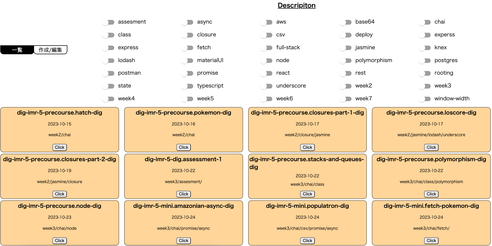
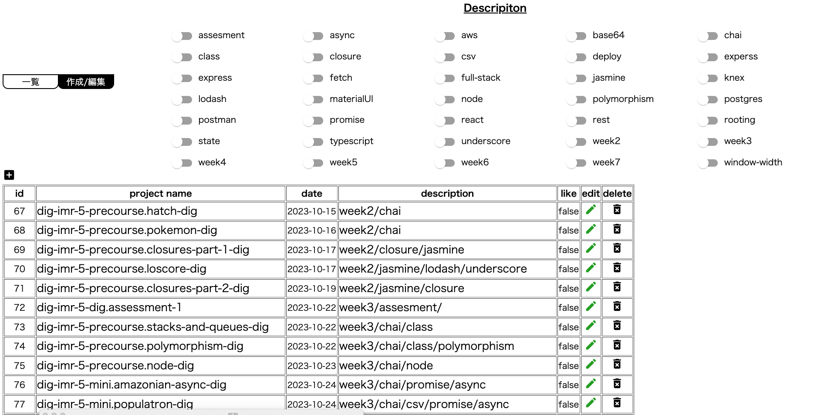
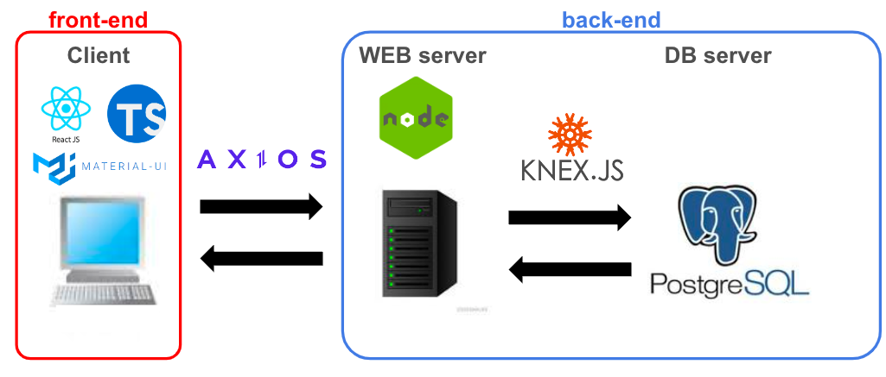

# Table of Contents

- [Features](#features)
- [Browser Support](#browser-support)
- [OverView App](#overview-app)
- [Installing & Setup](#installing--setup)

# Features

- Modify the style
- Deploy to some Paas
- Create authentification system

# Browser Support

- Chrome

# OverView App

### Main-page

- You can see the all lists and can sort according to toggle switch if you want!
  

### CRUD-page

- You can add, modify and delete the lists!
  

### System outline

- using bellow technique
  

# Installing & Setup

### server

1. change the directory to the server

```zh
cd server
```

2. install node_modules

```zh
npm install
```

3. create datebase as `github_repo_info`

4. create `.env` file directly under the server directory. As environment variables, `DB_USER`,`DB_PASSWORD`,`DB_NAME` and `NODE_ENV` are needed. for development envirnment `NODE_ENV` should be `development` and for production environment `NODE_ENV` should be `production`

5. set-up Database.

```zh
npm run all-setup
```

6. start the server

```zh
npm run start
```

### client

1.  change the directory to the client

```zh
cd client
```

2.  install node_modules

```zh
npm install
```

3.  start the react App

```zh
npm run dev
```
